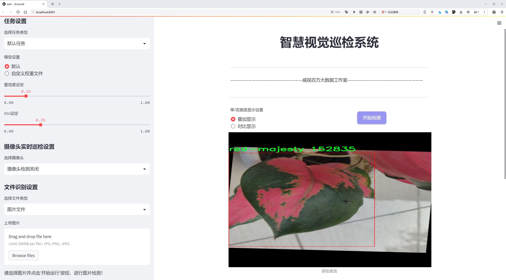
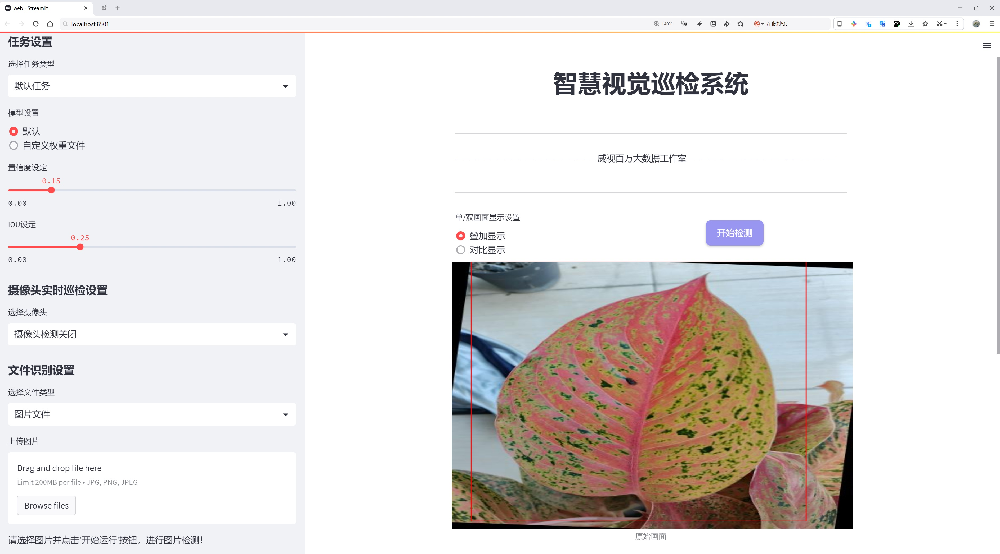
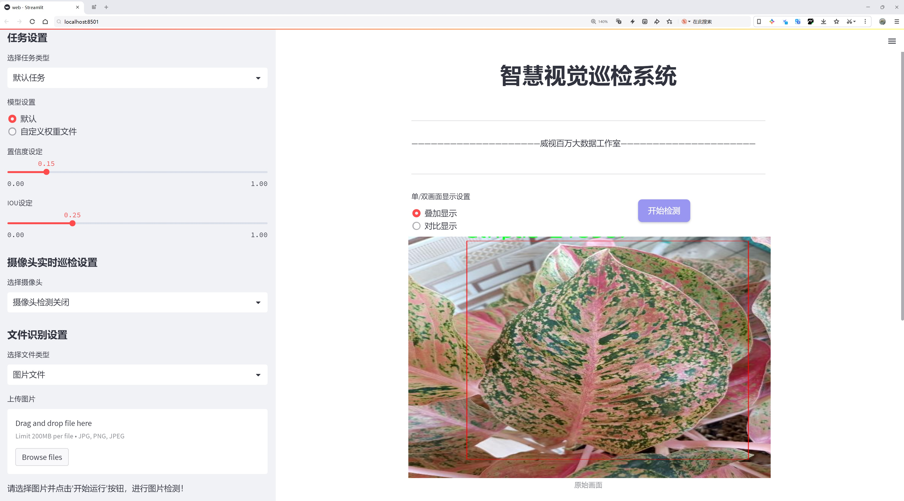
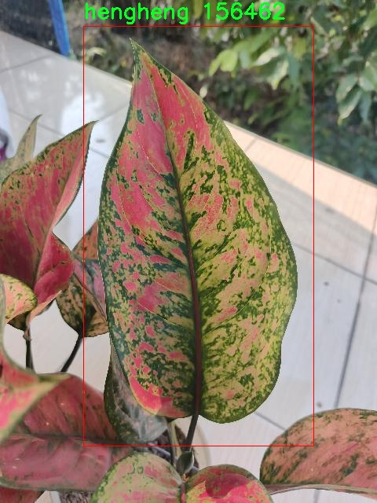
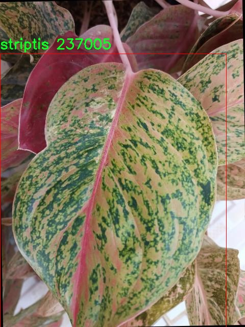
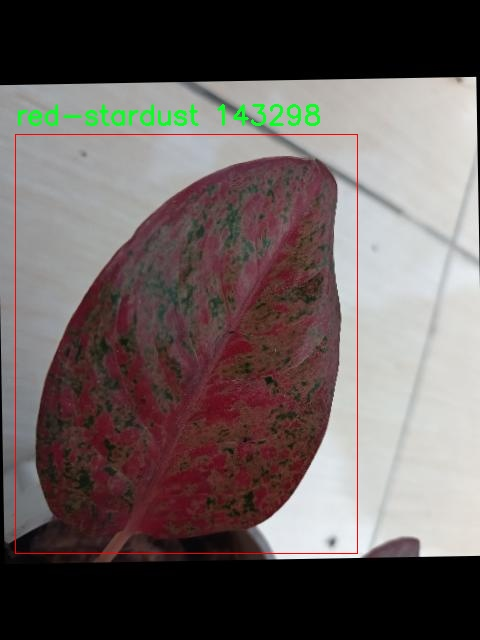
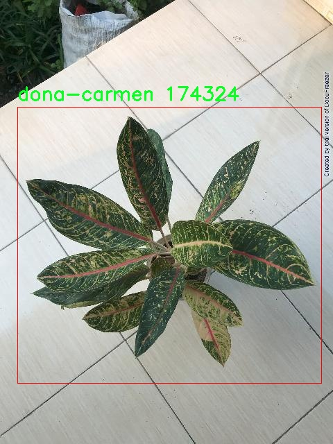
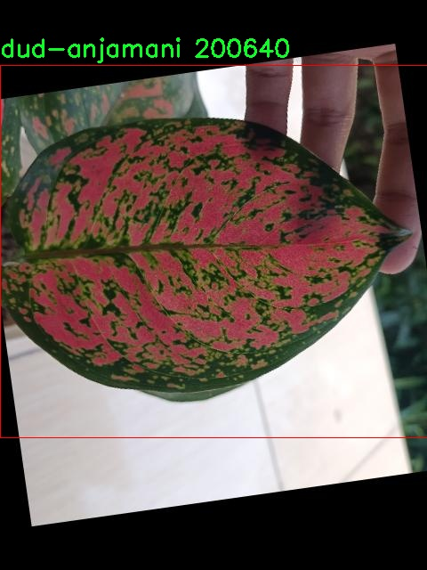

# 植物种类识别检测系统源码分享
 # [一条龙教学YOLOV8标注好的数据集一键训练_70+全套改进创新点发刊_Web前端展示]

### 1.研究背景与意义

项目参考[AAAI Association for the Advancement of Artificial Intelligence](https://gitee.com/qunmasj/projects)

项目来源[AACV Association for the Advancement of Computer Vision](https://kdocs.cn/l/cszuIiCKVNis)

研究背景与意义

随着全球生态环境的变化和人们对植物多样性认识的加深，植物种类的识别与分类在生态保护、农业生产和园艺管理等领域的重要性日益凸显。尤其是在热带和亚热带地区，植物种类繁多，尤其是观赏植物如芋头科植物（Aglaonema）因其独特的形态和色彩受到广泛喜爱。然而，传统的植物识别方法往往依赖于人工观察和专业知识，效率低下且容易受到主观因素的影响。因此，基于计算机视觉和深度学习技术的自动化植物识别系统应运而生，成为研究的热点。

YOLO（You Only Look Once）系列模型因其高效的实时目标检测能力而受到广泛关注。最新的YOLOv8模型在精度和速度上都有了显著提升，为植物种类识别提供了新的技术基础。通过对YOLOv8模型的改进，结合特定的植物数据集，可以进一步提高识别的准确性和鲁棒性。以Aglaonema为例，该植物种类下有16个不同的分类，涵盖了多种形态特征和色彩变化，构成了一个复杂的识别任务。现有的数据集包含1300张高质量的图像，为模型的训练和验证提供了丰富的样本支持。

在植物种类识别的研究中，数据集的构建和标注是至关重要的一环。通过对Aglaonema的16个分类进行详细标注，研究者能够利用深度学习模型进行有效的特征提取和分类。改进YOLOv8模型不仅能够提升对不同植物种类的识别能力，还能在处理复杂背景和光照变化时展现出更强的适应性。这一研究的意义在于，不仅可以为植物分类提供高效的工具，还能推动相关领域的研究进展，如生态监测、植物保护和生物多样性研究。

此外，基于改进YOLOv8的植物种类识别系统还具有广泛的应用前景。在农业生产中，及时准确地识别植物种类有助于农民进行科学管理，提高作物产量和质量。在园艺管理中，快速识别不同的观赏植物可以帮助园艺师进行合理的植物配置和养护。在生态保护方面，准确的植物种类识别有助于评估生态系统的健康状况和生物多样性，为保护措施的制定提供科学依据。

综上所述，基于改进YOLOv8的植物种类识别系统不仅在技术上具有创新性，更在生态保护、农业生产和园艺管理等领域展现出重要的应用价值。通过深入研究和开发这一系统，能够为植物种类的自动识别提供新的解决方案，推动相关领域的科学研究和实践应用，为实现可持续发展目标贡献力量。

### 2.图片演示







##### 注意：由于此博客编辑较早，上面“2.图片演示”和“3.视频演示”展示的系统图片或者视频可能为老版本，新版本在老版本的基础上升级如下：（实际效果以升级的新版本为准）

  （1）适配了YOLOV8的“目标检测”模型和“实例分割”模型，通过加载相应的权重（.pt）文件即可自适应加载模型。

  （2）支持“图片识别”、“视频识别”、“摄像头实时识别”三种识别模式。

  （3）支持“图片识别”、“视频识别”、“摄像头实时识别”三种识别结果保存导出，解决手动导出（容易卡顿出现爆内存）存在的问题，识别完自动保存结果并导出到tempDir中。

  （4）支持Web前端系统中的标题、背景图等自定义修改，后面提供修改教程。

  另外本项目提供训练的数据集和训练教程,暂不提供权重文件（best.pt）,需要您按照教程进行训练后实现图片演示和Web前端界面演示的效果。

### 3.视频演示

[3.1 视频演示](https://www.bilibili.com/video/BV1aR4ue3EBw/)

### 4.数据集信息展示

##### 4.1 本项目数据集详细数据（类别数＆类别名）

nc: 13
names: ['andini', 'big-roy', 'butterfly', 'dona-carmen', 'dud-anjamani', 'harlequin', 'hengheng', 'mahasety', 'red-majesty', 'red-stardust', 'striptis', 'suksom', 'sweet-dream']


##### 4.2 本项目数据集信息介绍

数据集信息展示

在植物种类识别系统的研究中，数据集的构建与选择至关重要。本研究所使用的数据集名为“aglaonema”，专门用于训练和改进YOLOv8模型，以实现对不同植物种类的高效识别。该数据集包含13个独特的植物类别，涵盖了多样的“aglaonema”品种，每个类别都代表了一种特定的植物特征与生长环境，确保了模型在实际应用中的准确性和鲁棒性。

“aglaonema”数据集的类别列表包括：andini、big-roy、butterfly、dona-carmen、dud-anjamani、harlequin、hengheng、mahasety、red-majesty、red-stardust、striptis、suksom和sweet-dream。这些类别不仅展示了“aglaonema”植物的丰富多样性，也为模型提供了充足的训练样本，以便在识别过程中捕捉到每种植物的独特特征。

首先，andini作为一种常见的“aglaonema”品种，以其独特的叶片纹理和色彩而闻名，具有很高的观赏价值。big-roy则以其大而宽的叶片吸引了众多植物爱好者，成为了家居绿化的热门选择。butterfly则因其叶片形状如蝴蝶翅膀而得名，展现了自然界的奇妙造型。dona-carmen则以其优雅的外观和色彩变化而受到喜爱，成为了许多室内植物布置的亮点。

在这些类别中，dud-anjamani和harlequin以其独特的斑驳色彩而备受关注，前者常常呈现出丰富的绿色和白色交错，后者则是以鲜艳的红色和绿色相结合，给人以强烈的视觉冲击。hengheng和mahasety则展现了不同的生长习性和环境适应性，前者适合在较为潮湿的环境中生长，而后者则在干燥条件下表现出良好的生存能力。

red-majesty和red-stardust则是“aglaonema”中较为稀有的品种，前者以其深红色的叶片而著称，后者则在叶片上点缀着星星般的斑点，形成了独特的视觉效果。striptis和suksom则是以其细长的叶片和独特的生长形态而受到关注，适合在阳光充足的环境中生长，展现出极强的生命力。最后，sweet-dream以其梦幻般的色彩组合而受到广泛喜爱，成为了许多植物爱好者的心头好。

通过对“aglaonema”数据集的深入分析，我们不仅能够训练出更为精准的YOLOv8模型，还能提升其在实际应用中的识别能力。这一数据集的构建与使用，将为植物种类识别技术的发展提供重要的支持，推动相关领域的研究进展。数据集的多样性和丰富性，确保了模型在面对不同环境和条件下的植物识别任务时，能够展现出良好的适应性和准确性，为未来的植物识别系统奠定了坚实的基础。











### 5.全套项目环境部署视频教程（零基础手把手教学）

[5.1 环境部署教程链接（零基础手把手教学）](https://www.ixigua.com/7404473917358506534?logTag=c807d0cbc21c0ef59de5)


[5.2 安装Python虚拟环境创建和依赖库安装视频教程链接（零基础手把手教学）](https://www.ixigua.com/7404474678003106304?logTag=1f1041108cd1f708b01a)

### 6.手把手YOLOV8训练视频教程（零基础小白有手就能学会）

[6.1 手把手YOLOV8训练视频教程（零基础小白有手就能学会）](https://www.ixigua.com/7404477157818401292?logTag=d31a2dfd1983c9668658)

### 7.70+种全套YOLOV8创新点代码加载调参视频教程（一键加载写好的改进模型的配置文件）

[7.1 70+种全套YOLOV8创新点代码加载调参视频教程（一键加载写好的改进模型的配置文件）](https://www.ixigua.com/7404478314661806627?logTag=29066f8288e3f4eea3a4)

### 8.70+种全套YOLOV8创新点原理讲解（非科班也可以轻松写刊发刊，V10版本正在科研待更新）

由于篇幅限制，每个创新点的具体原理讲解就不一一展开，具体见下列网址中的创新点对应子项目的技术原理博客网址【Blog】：


[8.1 70+种全套YOLOV8创新点原理讲解链接](https://gitee.com/qunmasj/good)

### 9.系统功能展示（检测对象为举例，实际内容以本项目数据集为准）

图9.1.系统支持检测结果表格显示

  图9.2.系统支持置信度和IOU阈值手动调节

  图9.3.系统支持自定义加载权重文件best.pt(需要你通过步骤5中训练获得)

  图9.4.系统支持摄像头实时识别

  图9.5.系统支持图片识别

  图9.6.系统支持视频识别

  图9.7.系统支持识别结果文件自动保存

  图9.8.系统支持Excel导出检测结果数据


### 10.原始YOLOV8算法原理

原始YOLOv8算法原理

YOLO（You Only Look Once）系列算法自问世以来，凭借其高效的目标检测能力和优越的实时性能，迅速成为计算机视觉领域的热门选择。随着技术的不断进步，YOLO系列算法经历了多个版本的迭代，最新的YOLOv8版本在精度和速度上均实现了显著的提升。YOLOv8的设计理念围绕着快速、准确和易用的目标检测展开，适用于各种图像分割和分类任务。

YOLOv8的网络结构主要由四个核心部分组成：输入模块、Backbone骨干网络、Neck特征融合网络和Head检测模块。首先，在输入模块中，YOLOv8对输入图像进行预处理，以适应不同的长宽比。默认情况下，YOLOv8将输入图像调整为640x640的尺寸，但在实际应用中，图像的长宽比往往各不相同。为了解决这一问题，YOLOv8采用自适应图像缩放技术，将图像较长的一边按比例缩小至指定尺寸，然后对缩小后的短边进行填充。这种处理方式不仅减少了填充区域的冗余信息，还提高了目标检测的速度和准确性。此外，YOLOv8在训练过程中引入了Mosaic数据增强技术，通过随机拼接四张不同的图像，生成新的训练样本，从而有效提升模型的泛化能力和预测精度。

在Backbone部分，YOLOv8的设计借鉴了YOLOv7中的ELAN模块，将YOLOv5中的C3模块替换为C2f模块。C2f模块通过并行多个梯度流分支，能够在保持轻量化的同时，提取更丰富的特征信息。这种结构优化使得YOLOv8在特征提取的过程中，能够更好地捕捉到不同尺度的目标信息，提升了模型的检测精度。为了进一步增强特征图的表达能力，YOLOv8还引入了SPPF（Spatial Pyramid Pooling Fast）模块，通过不同内核尺寸的池化操作，对特征图进行合并，确保网络能够有效处理多尺度目标。

Neck部分的设计同样至关重要，YOLOv8采用了双塔结构，结合了特征金字塔网络（FPN）和路径聚合网络（PAN）。这种结构的优势在于，它能够促进语义特征和定位特征之间的有效转移，进一步增强网络对不同尺度目标的检测能力。通过直接对Backbone不同阶段输出的特征进行上采样操作，YOLOv8简化了特征融合的过程，使得网络在保持高效性的同时，能够获取更丰富的特征信息。

在Head模块中，YOLOv8实现了从Coupled-Head（耦合头）到Decoupled-Head（解耦头）的转变。传统的耦合头结构将检测和分类任务共享同一卷积层，而YOLOv8则将这两个任务解耦，分别使用不同的卷积分支进行处理。这种设计不仅加速了模型的收敛速度，还提高了分类和边界框回归的精度。此外，YOLOv8在损失函数的设计上也进行了创新，取消了传统的对象分支，采用了更为高效的DFL（Distribution Focal Loss）和CIoU（Complete Intersection over Union）损失函数，使得模型能够更快地聚焦于标签附近的数值，提高了目标检测的准确性。

值得注意的是，YOLOv8在目标检测方法上也进行了重要的创新，摒弃了以往的Anchor-Based（基于锚框）方法，转而采用Anchor-Free（无锚框）的方法。这一转变使得YOLOv8在处理目标检测时，不再依赖于预设的锚框，而是将目标检测转化为关键点检测。这种方法的优势在于，模型的泛化能力更强，网络结构更为简洁，且在处理多样化的目标时，能够灵活应对不同的长宽比和尺度。

综上所述，YOLOv8算法通过一系列结构优化和技术创新，显著提升了目标检测的精度和速度。其独特的输入处理方式、灵活的Backbone设计、有效的特征融合策略以及解耦的Head结构，使得YOLOv8在复杂的视觉任务中表现出色。尽管在某些特定场景下仍存在一定的局限性，但YOLOv8无疑为目标检测领域提供了一个强有力的工具，推动了相关技术的进一步发展。未来，随着算法的不断优化和应用场景的拓展，YOLOv8有望在更多实际应用中发挥重要作用。


### 11.项目核心源码讲解（再也不用担心看不懂代码逻辑）

#### 11.1 70+种YOLOv8算法改进源码大全和调试加载训练教程（非必要）\ultralytics\models\sam\model.py

以下是对给定代码的核心部分进行提炼和详细注释的结果：

```python
# Ultralytics YOLO 🚀, AGPL-3.0 license
"""
SAM模型接口。

该模块提供了Ultralytics的Segment Anything Model (SAM)的接口，旨在进行实时图像分割任务。
SAM模型允许进行可提示的分割，具有在图像分析中的无与伦比的多功能性，并且已在SA-1B数据集上进行训练。
它具有零-shot性能能力，能够在没有先前知识的情况下适应新的图像分布和任务。
"""

from pathlib import Path
from ultralytics.engine.model import Model
from ultralytics.utils.torch_utils import model_info
from .build import build_sam
from .predict import Predictor


class SAM(Model):
    """
    SAM（Segment Anything Model）接口类。

    SAM旨在进行可提示的实时图像分割。可以使用多种提示，例如边界框、点或标签。
    该模型具有零-shot性能，并在SA-1B数据集上进行训练。
    """

    def __init__(self, model='sam_b.pt') -> None:
        """
        使用预训练模型文件初始化SAM模型。

        参数：
            model (str): 预训练SAM模型文件的路径。文件应具有.pt或.pth扩展名。

        异常：
            NotImplementedError: 如果模型文件扩展名不是.pt或.pth。
        """
        # 检查模型文件扩展名是否有效
        if model and Path(model).suffix not in ('.pt', '.pth'):
            raise NotImplementedError('SAM预测需要预训练的*.pt或*.pth模型。')
        super().__init__(model=model, task='segment')  # 调用父类构造函数

    def predict(self, source, stream=False, bboxes=None, points=None, labels=None, **kwargs):
        """
        对给定的图像或视频源执行分割预测。

        参数：
            source (str): 图像或视频文件的路径，或PIL.Image对象，或numpy.ndarray对象。
            stream (bool, optional): 如果为True，则启用实时流。默认为False。
            bboxes (list, optional): 提示分割的边界框坐标列表。默认为None。
            points (list, optional): 提示分割的点列表。默认为None。
            labels (list, optional): 提示分割的标签列表。默认为None。

        返回：
            (list): 模型预测结果。
        """
        # 设置预测的覆盖参数
        overrides = dict(conf=0.25, task='segment', mode='predict', imgsz=1024)
        kwargs.update(overrides)  # 更新参数
        prompts = dict(bboxes=bboxes, points=points, labels=labels)  # 收集提示信息
        return super().predict(source, stream, prompts=prompts, **kwargs)  # 调用父类的预测方法

    def info(self, detailed=False, verbose=True):
        """
        记录有关SAM模型的信息。

        参数：
            detailed (bool, optional): 如果为True，则显示有关模型的详细信息。默认为False。
            verbose (bool, optional): 如果为True，则在控制台上显示信息。默认为True。

        返回：
            (tuple): 包含模型信息的元组。
        """
        return model_info(self.model, detailed=detailed, verbose=verbose)  # 获取模型信息

    @property
    def task_map(self):
        """
        提供从“segment”任务到其对应的“Predictor”的映射。

        返回：
            (dict): 将“segment”任务映射到其对应的“Predictor”的字典。
        """
        return {'segment': {'predictor': Predictor}}  # 返回任务映射
```

### 核心部分分析
1. **类定义**：`SAM`类继承自`Model`，提供了图像分割的功能。
2. **初始化方法**：`__init__`方法负责加载预训练模型，并确保模型文件的有效性。
3. **预测方法**：`predict`方法执行图像分割预测，支持多种输入格式和提示方式。
4. **信息获取**：`info`方法用于获取和记录模型的相关信息。
5. **任务映射**：`task_map`属性提供了任务与预测器之间的映射关系。

这些部分构成了SAM模型的核心功能，支持实时图像分割和多种输入提示方式。

该文件是Ultralytics YOLO框架中的一个模块，主要用于实现Segment Anything Model（SAM）的接口。SAM模型专门设计用于实时图像分割任务，具有极高的灵活性，能够根据不同的提示进行分割，并且具备零-shot性能，可以在没有先前知识的情况下适应新的图像分布和任务。该模型经过SA-1B数据集的训练，支持多种提示方式，如边界框、点或标签。

在文件中，首先导入了一些必要的库和模块，包括`Path`用于处理文件路径，`Model`类用于继承，`model_info`用于获取模型信息，以及`build_sam`和`Predictor`用于构建模型和进行预测。

接下来定义了一个名为`SAM`的类，继承自`Model`类。该类的构造函数`__init__`接受一个模型文件路径作为参数，并检查文件扩展名是否为`.pt`或`.pth`，如果不是，则抛出`NotImplementedError`异常。然后调用父类的构造函数进行初始化。

`_load`方法用于加载指定的权重文件到SAM模型中，接受权重文件路径和任务名称作为参数。

`predict`方法是该类的核心功能之一，负责对给定的图像或视频源进行分割预测。它接受多个参数，包括源文件路径、是否启用实时流、边界框、点和标签等。该方法会将一些默认参数与用户提供的参数合并，并调用父类的`predict`方法进行实际的预测。

`__call__`方法是`predict`方法的别名，允许用户通过调用实例对象来进行预测，使用方式与`predict`方法相同。

`info`方法用于记录和返回关于SAM模型的信息，用户可以选择是否获取详细信息，并决定是否在控制台上显示信息。

最后，`task_map`属性提供了一个从“segment”任务到其对应的“Predictor”的映射，返回一个字典，便于在执行分割任务时进行相应的预测。

总体而言，该文件实现了SAM模型的基本功能和接口，便于用户进行图像分割任务的操作和模型信息的获取。

#### 11.2 70+种YOLOv8算法改进源码大全和调试加载训练教程（非必要）\ultralytics\nn\extra_modules\block.py

以下是经过简化和注释的核心代码部分，保留了最重要的功能和结构：

```python
import torch
import torch.nn as nn
import torch.nn.functional as F

# 自适应填充函数，确保输出形状与输入相同
def autopad(k, p=None, d=1):
    """根据卷积核大小和膨胀率自动计算填充大小"""
    if d > 1:
        k = d * (k - 1) + 1 if isinstance(k, int) else [d * (x - 1) + 1 for x in k]  # 实际的卷积核大小
    if p is None:
        p = k // 2 if isinstance(k, int) else [x // 2 for x in k]  # 自动填充
    return p

# 定义Swish激活函数
class swish(nn.Module):
    def forward(self, x):
        return x * torch.sigmoid(x)

# 定义带有HSigmoid激活函数的模块
class h_sigmoid(nn.Module):
    def __init__(self, inplace=True):
        super(h_sigmoid, self).__init__()
        self.relu = nn.ReLU6(inplace=inplace)

    def forward(self, x):
        return self.relu(x + 3) / 6

# 定义动态ReLU模块
class DyReLU(nn.Module):
    def __init__(self, inp, reduction=4):
        super(DyReLU, self).__init__()
        self.oup = inp
        squeeze = inp // reduction  # 确定压缩比
        self.fc = nn.Sequential(
            nn.Linear(inp, squeeze),
            nn.ReLU(inplace=True),
            nn.Linear(squeeze, self.oup * 2),  # 输出两个通道
            h_sigmoid()
        )

    def forward(self, x):
        b, c, h, w = x.size()
        y = self.fc(x.mean(dim=[2, 3])).view(b, self.oup * 2, 1, 1)  # 全局平均池化
        a1, b1 = torch.split(y, self.oup, dim=1)  # 分割为两个通道
        out = x * a1 + b1  # 应用动态ReLU
        return out

# 定义带有动态卷积的模块
class DyDCNv2(nn.Module):
    def __init__(self, in_channels, out_channels):
        super().__init__()
        self.conv = nn.Conv2d(in_channels, out_channels, kernel_size=3, padding=1)
        self.norm = nn.BatchNorm2d(out_channels)

    def forward(self, x):
        x = self.conv(x)
        x = self.norm(x)
        return x

# 定义DyHeadBlock模块，包含动态卷积和注意力机制
class DyHeadBlock(nn.Module):
    def __init__(self, in_channels):
        super().__init__()
        self.spatial_conv = DyDCNv2(in_channels, in_channels)
        self.task_attn_module = DyReLU(in_channels)

    def forward(self, x):
        mid_feat = self.spatial_conv(x)
        out = self.task_attn_module(mid_feat)
        return out

# 定义融合模块
class Fusion(nn.Module):
    def __init__(self, inc_list):
        super().__init__()
        self.fusion_conv = nn.ModuleList([nn.Conv2d(inc, inc, 1) for inc in inc_list])

    def forward(self, x):
        for i in range(len(x)):
            x[i] = self.fusion_conv[i](x[i])
        return torch.cat(x, dim=1)  # 将所有特征图拼接在一起

# 定义基本的卷积块
class Conv(nn.Module):
    def __init__(self, in_channels, out_channels, kernel_size, stride=1, padding=0):
        super().__init__()
        self.conv = nn.Conv2d(in_channels, out_channels, kernel_size, stride, padding)

    def forward(self, x):
        return self.conv(x)

# 定义主网络结构
class MainNet(nn.Module):
    def __init__(self, num_classes):
        super().__init__()
        self.conv1 = Conv(3, 32, 3, padding=1)
        self.dy_head = DyHeadBlock(32)
        self.fusion = Fusion([32, 32])

    def forward(self, x):
        x = self.conv1(x)
        x = self.dy_head(x)
        x = self.fusion([x, x])  # 进行特征融合
        return x

# 实例化网络
model = MainNet(num_classes=10)
```

### 代码注释说明：
1. **autopad**: 自动计算卷积的填充大小，以确保输出形状与输入形状相同。
2. **swish**: 定义Swish激活函数。
3. **h_sigmoid**: 定义带有HSigmoid激活函数的模块。
4. **DyReLU**: 动态ReLU模块，根据输入的特征图动态调整输出。
5. **DyDCNv2**: 带有动态卷积的模块，使用卷积和归一化层。
6. **DyHeadBlock**: 主要的头部模块，结合动态卷积和注意力机制。
7. **Fusion**: 融合模块，将多个输入特征图进行融合。
8. **Conv**: 基本的卷积块。
9. **MainNet**: 主网络结构，包含初始卷积层、动态头部和融合模块。

这个简化版本保留了核心结构和功能，同时提供了详细的中文注释，便于理解每个部分的作用。

这个程序文件是一个关于YOLOv8算法改进的深度学习模型的实现，主要涉及了多种模块和层的定义。文件中包含了许多不同的神经网络组件，这些组件可以组合在一起以构建复杂的网络结构。以下是对文件内容的逐步解析。

首先，文件导入了必要的库，包括PyTorch、NumPy和一些自定义模块。这些库提供了构建和训练深度学习模型所需的基本功能。

接下来，文件定义了一系列的神经网络模块，包括卷积层、注意力机制、残差块等。这些模块可以通过组合使用来实现不同的网络架构。例如，`Bottleneck`类是一个标准的瓶颈结构，通常用于深度学习模型中以减少参数数量和计算量。

文件中还定义了多种改进的卷积层，如`GhostConv`、`RepConv`和`DWConv`，这些层通过不同的方式优化了计算效率和模型性能。`GhostConv`是通过生成更少的特征图来减少计算量，而`RepConv`则通过使用可重参数化的卷积来提高灵活性。

注意力机制在文件中也得到了广泛应用，例如`DyHeadBlock`和`FocusedLinearAttention`类，这些类通过引入注意力机制来增强模型对重要特征的关注，从而提高性能。

此外，文件中还实现了一些特定的模块，如`FocalModulation`和`ContextGuidedBlock`，这些模块通过不同的方式来增强特征提取和信息融合的能力。

在实现细节上，文件使用了许多PyTorch的特性，如自定义的前向传播方法、模块的组合和参数的初始化等。通过这些实现，文件展示了如何构建一个复杂的深度学习模型，特别是针对目标检测任务的YOLOv8模型。

最后，文件还包含了一些用于模型训练和推理的实用功能，如自适应平均池化、DropPath等，这些功能可以帮助模型在训练过程中更好地学习和泛化。

总的来说，这个程序文件提供了一个全面的YOLOv8算法改进的实现，涵盖了从基础卷积层到复杂的注意力机制和特征融合模块的多种组件，适合用于目标检测等计算机视觉任务。

#### 11.3 ui.py

```python
import sys
import subprocess

def run_script(script_path):
    """
    使用当前 Python 环境运行指定的脚本。

    Args:
        script_path (str): 要运行的脚本路径

    Returns:
        None
    """
    # 获取当前 Python 解释器的路径
    python_path = sys.executable

    # 构建运行命令，使用 streamlit 运行指定的脚本
    command = f'"{python_path}" -m streamlit run "{script_path}"'

    # 执行命令
    result = subprocess.run(command, shell=True)
    # 检查命令执行结果，如果返回码不为0，表示执行出错
    if result.returncode != 0:
        print("脚本运行出错。")

# 实例化并运行应用
if __name__ == "__main__":
    # 指定要运行的脚本路径
    script_path = "web.py"  # 假设脚本在当前目录下

    # 运行脚本
    run_script(script_path)
```

### 代码核心部分及注释

1. **导入模块**：
   - `sys`：用于获取当前 Python 解释器的路径。
   - `subprocess`：用于执行外部命令。

2. **`run_script` 函数**：
   - **参数**：接收一个字符串参数 `script_path`，表示要运行的脚本的路径。
   - **获取 Python 解释器路径**：使用 `sys.executable` 获取当前 Python 解释器的完整路径。
   - **构建命令**：使用 f-string 构建一个命令字符串，格式为 `"{python_path}" -m streamlit run "{script_path}"`，用于通过 `streamlit` 运行指定的脚本。
   - **执行命令**：使用 `subprocess.run` 执行构建的命令，`shell=True` 表示在 shell 中执行命令。
   - **检查执行结果**：通过 `result.returncode` 检查命令的返回码，如果不为0，表示执行出错，打印错误信息。

3. **主程序入口**：
   - `if __name__ == "__main__":` 确保只有在直接运行该脚本时才会执行以下代码。
   - **指定脚本路径**：假设要运行的脚本为 `web.py`，可以根据实际情况修改路径。
   - **调用 `run_script` 函数**：传入脚本路径，执行该脚本。

这个程序文件名为 `ui.py`，其主要功能是通过当前的 Python 环境来运行一个指定的脚本，具体是一个名为 `web.py` 的文件。程序首先导入了必要的模块，包括 `sys`、`os` 和 `subprocess`，这些模块分别用于获取系统信息、操作系统功能和执行外部命令。

在 `run_script` 函数中，首先定义了一个参数 `script_path`，用于接收要运行的脚本的路径。函数内部通过 `sys.executable` 获取当前 Python 解释器的路径，然后构建一个命令字符串，该命令用于运行 Streamlit 应用。命令的格式是 `"{python_path}" -m streamlit run "{script_path}"`，其中 `python_path` 是 Python 解释器的路径，`script_path` 是传入的脚本路径。

接下来，使用 `subprocess.run` 方法执行构建好的命令。该方法的 `shell=True` 参数允许在 shell 中执行命令。执行后，程序会检查返回的结果代码，如果返回值不为 0，表示脚本运行出错，程序会打印出错误信息。

在文件的最后部分，使用 `if __name__ == "__main__":` 语句来确保只有在直接运行该文件时才会执行后面的代码。此处指定了要运行的脚本路径为 `web.py`，并调用 `run_script` 函数来执行这个脚本。

总体来看，这个程序的主要目的是为了方便地通过当前 Python 环境来启动一个 Streamlit 应用，提供了一种简单的方式来运行和调试 Web 应用。

#### 11.4 code\ultralytics\models\yolo\segment\val.py

以下是代码中最核心的部分，并附上详细的中文注释：

```python
class SegmentationValidator(DetectionValidator):
    """
    扩展自 DetectionValidator 类的分割验证器，用于基于分割模型的验证。
    """

    def __init__(self, dataloader=None, save_dir=None, pbar=None, args=None, _callbacks=None):
        """初始化 SegmentationValidator，设置任务为 'segment'，并初始化指标为 SegmentMetrics。"""
        super().__init__(dataloader, save_dir, pbar, args, _callbacks)
        self.plot_masks = None  # 用于存储绘制的掩码
        self.process = None  # 掩码处理函数
        self.args.task = "segment"  # 设置任务类型为分割
        self.metrics = SegmentMetrics(save_dir=self.save_dir, on_plot=self.on_plot)  # 初始化指标

    def preprocess(self, batch):
        """预处理批次，将掩码转换为浮点数并发送到设备。"""
        batch = super().preprocess(batch)  # 调用父类的预处理方法
        batch["masks"] = batch["masks"].to(self.device).float()  # 将掩码转移到设备并转换为浮点数
        return batch

    def postprocess(self, preds):
        """后处理 YOLO 预测，返回输出检测结果和原型。"""
        p = ops.non_max_suppression(
            preds[0],
            self.args.conf,
            self.args.iou,
            labels=self.lb,
            multi_label=True,
            agnostic=self.args.single_cls,
            max_det=self.args.max_det,
            nc=self.nc,
        )  # 应用非极大值抑制
        proto = preds[1][-1] if len(preds[1]) == 3 else preds[1]  # 获取原型
        return p, proto  # 返回处理后的预测和原型

    def update_metrics(self, preds, batch):
        """更新指标，计算真阳性、预测类别等。"""
        for si, (pred, proto) in enumerate(zip(preds[0], preds[1])):
            self.seen += 1  # 记录已处理的样本数量
            npr = len(pred)  # 当前预测的数量
            stat = dict(
                conf=torch.zeros(0, device=self.device),
                pred_cls=torch.zeros(0, device=self.device),
                tp=torch.zeros(npr, self.niou, dtype=torch.bool, device=self.device),
                tp_m=torch.zeros(npr, self.niou, dtype=torch.bool, device=self.device),
            )  # 初始化统计信息
            pbatch = self._prepare_batch(si, batch)  # 准备当前批次
            cls, bbox = pbatch.pop("cls"), pbatch.pop("bbox")  # 获取类别和边界框
            nl = len(cls)  # 目标数量
            stat["target_cls"] = cls  # 记录目标类别
            if npr == 0:  # 如果没有预测
                if nl:
                    for k in self.stats.keys():
                        self.stats[k].append(stat[k])  # 更新统计信息
                continue

            # 处理掩码
            gt_masks = pbatch.pop("masks")  # 获取真实掩码
            predn, pred_masks = self._prepare_pred(pred, pbatch, proto)  # 准备预测结果和掩码
            stat["conf"] = predn[:, 4]  # 记录置信度
            stat["pred_cls"] = predn[:, 5]  # 记录预测类别

            # 评估
            if nl:
                stat["tp"] = self._process_batch(predn, bbox, cls)  # 处理边界框
                stat["tp_m"] = self._process_batch(
                    predn, bbox, cls, pred_masks, gt_masks, self.args.overlap_mask, masks=True
                )  # 处理掩码
            for k in self.stats.keys():
                self.stats[k].append(stat[k])  # 更新统计信息

    def _process_batch(self, detections, gt_bboxes, gt_cls, pred_masks=None, gt_masks=None, overlap=False, masks=False):
        """
        返回正确的预测矩阵。

        参数:
            detections (array[N, 6]), x1, y1, x2, y2, conf, class
            labels (array[M, 5]), class, x1, y1, x2, y2

        返回:
            correct (array[N, 10]), 对于 10 个 IoU 水平
        """
        if masks:
            # 处理掩码的情况
            if overlap:
                nl = len(gt_cls)
                index = torch.arange(nl, device=gt_masks.device).view(nl, 1, 1) + 1
                gt_masks = gt_masks.repeat(nl, 1, 1)  # 扩展掩码
                gt_masks = torch.where(gt_masks == index, 1.0, 0.0)  # 创建掩码
            if gt_masks.shape[1:] != pred_masks.shape[1:]:
                gt_masks = F.interpolate(gt_masks[None], pred_masks.shape[1:], mode="bilinear", align_corners=False)[0]
                gt_masks = gt_masks.gt_(0.5)  # 进行阈值处理
            iou = mask_iou(gt_masks.view(gt_masks.shape[0], -1), pred_masks.view(pred_masks.shape[0], -1))  # 计算掩码的 IoU
        else:  # 处理边界框的情况
            iou = box_iou(gt_bboxes, detections[:, :4])  # 计算边界框的 IoU

        return self.match_predictions(detections[:, 5], gt_cls, iou)  # 匹配预测与真实标签

    def eval_json(self, stats):
        """返回 COCO 风格的目标检测评估指标。"""
        if self.args.save_json and self.is_coco and len(self.jdict):
            anno_json = self.data["path"] / "annotations/instances_val2017.json"  # 注释文件路径
            pred_json = self.save_dir / "predictions.json"  # 预测结果文件路径
            LOGGER.info(f"\nEvaluating pycocotools mAP using {pred_json} and {anno_json}...")
            try:
                check_requirements("pycocotools>=2.0.6")  # 检查依赖
                from pycocotools.coco import COCO  # 导入 COCO API
                from pycocotools.cocoeval import COCOeval  # 导入 COCO 评估类

                for x in anno_json, pred_json:
                    assert x.is_file(), f"{x} file not found"  # 确保文件存在
                anno = COCO(str(anno_json))  # 初始化注释 API
                pred = anno.loadRes(str(pred_json))  # 初始化预测 API
                for i, eval in enumerate([COCOeval(anno, pred, "bbox"), COCOeval(anno, pred, "segm")]):
                    if self.is_coco:
                        eval.params.imgIds = [int(Path(x).stem) for x in self.dataloader.dataset.im_files]  # 设置评估的图像 ID
                    eval.evaluate()  # 评估
                    eval.accumulate()  # 累计结果
                    eval.summarize()  # 总结结果
                    idx = i * 4 + 2
                    stats[self.metrics.keys[idx + 1]], stats[self.metrics.keys[idx]] = eval.stats[:2]  # 更新 mAP50-95 和 mAP50
            except Exception as e:
                LOGGER.warning(f"pycocotools unable to run: {e}")  # 捕获异常并记录警告
        return stats  # 返回统计信息
```

以上代码是 YOLO 分割模型验证的核心部分，包含了模型的初始化、数据预处理、后处理、指标更新和评估等功能。每个方法都附有详细的中文注释，便于理解其功能和实现逻辑。

这个程序文件 `val.py` 是用于验证基于 YOLO（You Only Look Once）模型的图像分割任务的。它扩展了 `DetectionValidator` 类，专门用于处理分割模型的验证过程。程序的主要功能包括数据预处理、模型评估、结果后处理以及可视化等。

在初始化 `SegmentationValidator` 类时，构造函数接收一些参数，包括数据加载器、保存目录、进度条、其他参数和回调函数。它调用父类的构造函数，并设置任务类型为“分割”，同时初始化用于评估的指标 `SegmentMetrics`。

在 `preprocess` 方法中，输入的批次数据会被处理，将掩码（mask）转换为浮点数并移动到指定的设备（如 GPU）。`init_metrics` 方法用于初始化评估指标，并根据是否需要保存 JSON 文件来选择掩码处理函数。

`get_desc` 方法返回格式化的评估指标描述，便于在输出中查看各类指标的表现。`postprocess` 方法对 YOLO 模型的预测结果进行后处理，返回处理后的检测结果和原型数据。

在 `_prepare_batch` 方法中，准备输入批次数据，确保掩码数据正确处理。`_prepare_pred` 方法则用于准备预测结果和掩码。`update_metrics` 方法负责更新评估指标，包括真阳性（TP）和预测掩码的处理。

`finalize_metrics` 方法用于设置评估指标的速度和混淆矩阵。`_process_batch` 方法用于处理每个批次的检测结果，计算与真实标签的重叠程度（IoU），并返回正确的预测矩阵。

在 `plot_val_samples` 和 `plot_predictions` 方法中，程序会将验证样本和预测结果可视化，便于观察模型的性能。`pred_to_json` 方法则将预测结果保存为 JSON 格式，便于后续分析和评估。

最后，`eval_json` 方法用于返回 COCO 风格的目标检测评估指标，支持使用 pycocotools 进行评估，计算模型在验证集上的 mAP（平均精度均值）等指标。

总体而言，这个文件实现了一个完整的图像分割模型验证流程，包括数据预处理、模型评估、结果处理和可视化等功能，适用于使用 YOLO 模型进行分割任务的场景。

#### 11.5 code\ultralytics\data\base.py

以下是经过简化和注释的核心代码部分：

```python
import glob
import os
from pathlib import Path
import cv2
import numpy as np
from torch.utils.data import Dataset

class BaseDataset(Dataset):
    """
    基础数据集类，用于加载和处理图像数据。

    参数:
        img_path (str): 图像文件夹的路径。
        imgsz (int, optional): 图像大小，默认为640。
        augment (bool, optional): 是否应用数据增强，默认为True。
        classes (list): 包含的类别列表，默认为None。
    """

    def __init__(self, img_path, imgsz=640, augment=True, classes=None):
        """初始化BaseDataset类，设置配置和选项。"""
        super().__init__()
        self.img_path = img_path  # 图像路径
        self.imgsz = imgsz  # 图像大小
        self.augment = augment  # 是否进行数据增强
        self.im_files = self.get_img_files(self.img_path)  # 获取图像文件列表
        self.labels = self.get_labels()  # 获取标签
        self.update_labels(include_class=classes)  # 更新标签以包含指定类别
        self.ni = len(self.labels)  # 数据集中图像的数量

    def get_img_files(self, img_path):
        """读取图像文件。"""
        f = []  # 存储图像文件路径
        # 遍历图像路径
        for p in img_path if isinstance(img_path, list) else [img_path]:
            p = Path(p)  # 使用Path处理路径
            if p.is_dir():  # 如果是目录
                f += glob.glob(str(p / "**" / "*.*"), recursive=True)  # 获取目录下所有图像文件
            elif p.is_file():  # 如果是文件
                with open(p) as t:
                    t = t.read().strip().splitlines()  # 读取文件内容
                    parent = str(p.parent) + os.sep
                    f += [x.replace("./", parent) if x.startswith("./") else x for x in t]  # 转换为全局路径
            else:
                raise FileNotFoundError(f"{p} 不存在")
        # 过滤出有效的图像文件
        im_files = sorted(x for x in f if x.split(".")[-1].lower() in ['jpg', 'jpeg', 'png', 'bmp'])
        assert im_files, f"在 {img_path} 中未找到图像"
        return im_files

    def update_labels(self, include_class):
        """更新标签以仅包含指定类别（可选）。"""
        for i in range(len(self.labels)):
            if include_class is not None:
                cls = self.labels[i]["cls"]
                bboxes = self.labels[i]["bboxes"]
                # 过滤标签
                j = np.isin(cls, include_class)
                self.labels[i]["cls"] = cls[j]
                self.labels[i]["bboxes"] = bboxes[j]

    def load_image(self, i):
        """加载数据集中索引为 'i' 的图像，返回图像及其原始和调整后的尺寸。"""
        im = cv2.imread(self.im_files[i])  # 读取图像
        if im is None:
            raise FileNotFoundError(f"未找到图像 {self.im_files[i]}")
        # 调整图像大小
        im = cv2.resize(im, (self.imgsz, self.imgsz), interpolation=cv2.INTER_LINEAR)
        return im

    def __getitem__(self, index):
        """返回给定索引的图像和标签信息。"""
        label = self.labels[index]  # 获取标签
        label["img"] = self.load_image(index)  # 加载图像
        return label

    def __len__(self):
        """返回数据集中标签的数量。"""
        return len(self.labels)

    def get_labels(self):
        """用户可以自定义标签格式，这里返回一个示例。"""
        # 这里应返回一个包含标签信息的字典
        raise NotImplementedError
```

### 代码说明：
1. **类定义**：`BaseDataset`类继承自`Dataset`，用于处理图像数据集。
2. **初始化方法**：构造函数接收图像路径、图像大小、数据增强标志和类别列表，并初始化相关属性。
3. **获取图像文件**：`get_img_files`方法用于读取指定路径下的所有图像文件，并返回有效的图像文件列表。
4. **更新标签**：`update_labels`方法根据给定的类别列表更新标签，只保留指定类别的标签。
5. **加载图像**：`load_image`方法根据索引加载图像，并调整其大小。
6. **获取项**：`__getitem__`方法返回指定索引的图像和标签信息。
7. **长度**：`__len__`方法返回数据集中标签的数量。
8. **获取标签**：`get_labels`方法需要用户自定义实现，以返回特定格式的标签信息。

这个程序文件定义了一个名为 `BaseDataset` 的类，主要用于加载和处理图像数据，特别是在训练深度学习模型时。该类继承自 PyTorch 的 `Dataset` 类，提供了一系列方法和属性来支持图像数据的读取、预处理和增强。

在初始化方法 `__init__` 中，用户可以传入多个参数来配置数据集的行为，例如图像路径、图像大小、是否缓存图像、是否进行数据增强等。初始化过程中，类会读取指定路径下的图像文件，并获取对应的标签信息。标签信息会根据用户指定的类别进行更新，支持单类训练和多类训练的灵活性。

`get_img_files` 方法用于读取图像文件，支持从目录或文件中获取图像路径，并确保只获取指定格式的图像文件。如果指定的路径无效，方法会抛出 `FileNotFoundError`。在获取图像文件时，还可以根据 `fraction` 参数来控制使用数据集的比例。

`update_labels` 方法则用于更新标签，只保留用户指定的类别，适用于多类和单类训练的需求。`load_image` 方法负责加载指定索引的图像，并根据需要进行尺寸调整。该方法支持长边调整以保持图像的纵横比，或直接拉伸图像到指定大小。

缓存功能是该类的一个重要特性。`cache_images` 方法可以将图像缓存到内存或磁盘，以加快后续的加载速度。`check_cache_ram` 方法则用于检查当前系统的内存是否足够存储缓存的图像，确保在训练过程中不会因为内存不足而导致错误。

在处理图像时，如果启用了数据增强，类会将图像和其原始尺寸信息存储在一个缓冲区中，以便在训练时进行随机增强。`set_rectangle` 方法则用于设置边界框的形状，以适应 YOLO 检测模型的需求。

类的 `__getitem__` 方法返回指定索引的图像及其标签信息，并应用预定义的变换。`get_image_and_label` 方法则用于获取图像和标签的详细信息，并计算图像的填充比例。

此外，类还定义了 `build_transforms` 和 `get_labels` 方法，允许用户自定义数据增强和标签格式。这些方法目前是未实现的，用户需要根据具体需求进行实现。

总的来说，`BaseDataset` 类为图像数据的加载和处理提供了一个灵活且高效的框架，适用于各种深度学习任务，尤其是在使用 YOLO 等目标检测模型时。

#### 11.6 train.py

以下是经过简化和注释的核心代码部分：

```python
import random
import numpy as np
import torch.nn as nn
from ultralytics.data import build_dataloader, build_yolo_dataset
from ultralytics.engine.trainer import BaseTrainer
from ultralytics.models import yolo
from ultralytics.nn.tasks import DetectionModel
from ultralytics.utils import LOGGER, RANK
from ultralytics.utils.torch_utils import de_parallel, torch_distributed_zero_first

class DetectionTrainer(BaseTrainer):
    """
    扩展自 BaseTrainer 类，用于基于检测模型的训练。
    """

    def build_dataset(self, img_path, mode="train", batch=None):
        """
        构建 YOLO 数据集。

        参数:
            img_path (str): 包含图像的文件夹路径。
            mode (str): 模式，可以是 'train' 或 'val'，用户可以为每种模式自定义不同的增强。
            batch (int, optional): 批次大小，仅用于 'rect' 模式。默认为 None。
        """
        gs = max(int(de_parallel(self.model).stride.max() if self.model else 0), 32)  # 获取模型的最大步幅
        return build_yolo_dataset(self.args, img_path, batch, self.data, mode=mode, rect=mode == "val", stride=gs)

    def get_dataloader(self, dataset_path, batch_size=16, rank=0, mode="train"):
        """构造并返回数据加载器。"""
        assert mode in ["train", "val"]  # 确保模式有效
        with torch_distributed_zero_first(rank):  # 在分布式训练中，确保数据集只初始化一次
            dataset = self.build_dataset(dataset_path, mode, batch_size)  # 构建数据集
        shuffle = mode == "train"  # 训练模式下打乱数据
        workers = self.args.workers if mode == "train" else self.args.workers * 2  # 设置工作线程数
        return build_dataloader(dataset, batch_size, workers, shuffle, rank)  # 返回数据加载器

    def preprocess_batch(self, batch):
        """对一批图像进行预处理，包括缩放和转换为浮点数。"""
        batch["img"] = batch["img"].to(self.device, non_blocking=True).float() / 255  # 将图像转移到设备并归一化
        if self.args.multi_scale:  # 如果启用多尺度
            imgs = batch["img"]
            sz = (
                random.randrange(self.args.imgsz * 0.5, self.args.imgsz * 1.5 + self.stride)
                // self.stride
                * self.stride
            )  # 随机选择图像大小
            sf = sz / max(imgs.shape[2:])  # 计算缩放因子
            if sf != 1:  # 如果需要缩放
                ns = [
                    math.ceil(x * sf / self.stride) * self.stride for x in imgs.shape[2:]
                ]  # 计算新的形状
                imgs = nn.functional.interpolate(imgs, size=ns, mode="bilinear", align_corners=False)  # 进行插值缩放
            batch["img"] = imgs  # 更新批次图像
        return batch

    def set_model_attributes(self):
        """设置模型的属性，包括类别数量和名称。"""
        self.model.nc = self.data["nc"]  # 将类别数量附加到模型
        self.model.names = self.data["names"]  # 将类别名称附加到模型
        self.model.args = self.args  # 将超参数附加到模型

    def get_model(self, cfg=None, weights=None, verbose=True):
        """返回 YOLO 检测模型。"""
        model = DetectionModel(cfg, nc=self.data["nc"], verbose=verbose and RANK == -1)  # 创建检测模型
        if weights:
            model.load(weights)  # 加载权重
        return model

    def plot_training_samples(self, batch, ni):
        """绘制带有注释的训练样本。"""
        plot_images(
            images=batch["img"],
            batch_idx=batch["batch_idx"],
            cls=batch["cls"].squeeze(-1),
            bboxes=batch["bboxes"],
            paths=batch["im_file"],
            fname=self.save_dir / f"train_batch{ni}.jpg",
            on_plot=self.on_plot,
        )
```

### 代码说明：
1. **DetectionTrainer 类**：继承自 `BaseTrainer`，用于实现 YOLO 模型的训练。
2. **build_dataset 方法**：根据给定的图像路径和模式构建数据集，支持训练和验证模式。
3. **get_dataloader 方法**：构造数据加载器，确保在分布式训练中只初始化一次数据集。
4. **preprocess_batch 方法**：对输入的图像批次进行预处理，包括归一化和可选的多尺度调整。
5. **set_model_attributes 方法**：设置模型的类别数量和名称等属性。
6. **get_model 方法**：返回一个 YOLO 检测模型，并可选择加载预训练权重。
7. **plot_training_samples 方法**：绘制训练样本及其对应的标注，便于可视化训练过程。

这个程序文件 `train.py` 是一个用于训练 YOLO（You Only Look Once）目标检测模型的实现，继承自 `BaseTrainer` 类。它包含了一系列方法，用于构建数据集、加载数据、预处理图像、设置模型属性、获取模型、验证模型、记录损失、绘制训练样本和绘制训练指标等。

首先，`DetectionTrainer` 类的构造函数中定义了模型的基本属性，包括数据集的路径、模型的配置、训练的轮数等。`build_dataset` 方法用于构建 YOLO 数据集，接收图像路径、模式（训练或验证）和批次大小作为参数。它通过调用 `build_yolo_dataset` 函数来创建数据集，支持不同模式下的增强。

`get_dataloader` 方法则用于构建并返回数据加载器，确保在分布式训练时只初始化一次数据集。它根据模式决定是否打乱数据，并根据工作线程数进行设置。`preprocess_batch` 方法负责对图像批次进行预处理，包括将图像缩放到适当的大小并转换为浮点数格式。

在设置模型属性的 `set_model_attributes` 方法中，模型的类别数和类别名称被附加到模型上，以便于后续的训练和评估。`get_model` 方法返回一个 YOLO 检测模型实例，并可选择加载预训练权重。

`get_validator` 方法返回一个用于验证模型的 `DetectionValidator` 实例，负责计算和记录模型在验证集上的损失。`label_loss_items` 方法用于返回带有标签的训练损失字典，便于监控训练过程中的损失变化。

`progress_string` 方法生成一个格式化的字符串，显示训练进度，包括当前轮次、GPU 内存使用情况、损失值、实例数量和图像大小等信息。`plot_training_samples` 方法用于绘制训练样本及其标注，便于可视化训练过程中的数据。

最后，`plot_metrics` 和 `plot_training_labels` 方法分别用于绘制训练过程中记录的指标和创建带标签的训练图，以便于分析模型的训练效果和性能。

总体来说，这个文件实现了 YOLO 模型训练的各个方面，提供了从数据加载到模型评估的完整流程，适合用于目标检测任务的训练和调试。

### 12.系统整体结构（节选）

### 整体功能和构架概括

该项目是一个基于 YOLOv8 的目标检测和图像分割模型的实现，包含了多个模块和文件，旨在提供一个完整的训练、验证和推理框架。整体架构包括数据处理、模型定义、训练过程、验证过程以及可视化工具等。每个模块都有其特定的功能，协同工作以实现高效的目标检测和分割任务。

- **数据处理**：包括数据集的加载、预处理和增强，确保模型在训练过程中能够接收到高质量的数据。
- **模型定义**：定义了不同的 YOLO 模型和其他相关模型（如 SAM），提供了灵活的网络结构和组件。
- **训练和验证**：实现了训练过程的控制，包括损失计算、模型评估和性能监控。
- **可视化**：提供了绘制训练样本和评估指标的功能，帮助用户理解模型的表现。

### 文件功能整理表

| 文件路径                                                                                         | 功能描述                                                         |
|--------------------------------------------------------------------------------------------------|------------------------------------------------------------------|
| `C:\shangjia\code\70+种YOLOv8算法改进源码大全和调试加载训练教程（非必要）\ultralytics\models\sam\model.py` | 实现 Segment Anything Model (SAM) 的接口和预测功能。            |
| `C:\shangjia\code\70+种YOLOv8算法改进源码大全和调试加载训练教程（非必要）\ultralytics\nn\extra_modules\block.py` | 定义多种神经网络模块和层，优化计算效率和模型性能。              |
| `C:\shangjia\code\ui.py`                                                                        | 启动 Streamlit 应用的脚本，提供用户界面以运行模型。              |
| `C:\shangjia\code\code\ultralytics\models\yolo\segment\val.py`                                | 实现分割模型的验证过程，包括数据预处理和评估指标计算。          |
| `C:\shangjia\code\code\ultralytics\data\base.py`                                              | 定义基础数据集类，负责图像数据的加载、预处理和增强。            |
| `C:\shangjia\code\train.py`                                                                     | 实现 YOLO 模型的训练过程，包括数据加载、模型设置和损失记录。    |
| `C:\shangjia\code\code\ultralytics\hub\auth.py`                                               | 处理用户认证和模型下载的相关功能。                              |
| `C:\shangjia\code\code\ultralytics\models\rtdetr\train.py`                                    | 实现 RT-DETR 模型的训练过程，专注于实时目标检测。                |
| `C:\shangjia\code\code\ultralytics\nn\tasks.py`                                               | 定义不同的任务（如检测、分割）的接口和功能。                    |
| `C:\shangjia\code\code\ultralytics\models\yolo\model.py`                                      | 定义 YOLO 模型的结构和前向传播逻辑。                             |
| `C:\shangjia\code\70+种YOLOv8算法改进源码大全和调试加载训练教程（非必要）\ultralytics\utils\plotting.py` | 提供可视化工具，用于绘制训练过程中的样本和指标。                |
| `C:\shangjia\code\70+种YOLOv8算法改进源码大全和调试加载训练教程（非必要）\ultralytics\data\converter.py` | 处理数据格式转换，支持不同数据集格式的加载。                    |
| `C:\shangjia\code\70+种YOLOv8算法改进源码大全和调试加载训练教程（非必要）\ultralytics\models\sam\modules\tiny_encoder.py` | 定义 SAM 模型中的编码器模块，处理输入数据的特征提取。          |

以上表格总结了每个文件的主要功能，展示了该项目的整体架构和各个模块之间的关系。

注意：由于此博客编辑较早，上面“11.项目核心源码讲解（再也不用担心看不懂代码逻辑）”中部分代码可能会优化升级，仅供参考学习，完整“训练源码”、“Web前端界面”和“70+种创新点源码”以“13.完整训练+Web前端界面+70+种创新点源码、数据集获取”的内容为准。

### 13.完整训练+Web前端界面+70+种创新点源码、数据集获取


# [下载链接：https://mbd.pub/o/bread/ZpyUl5ts](https://mbd.pub/o/bread/ZpyUl5ts)